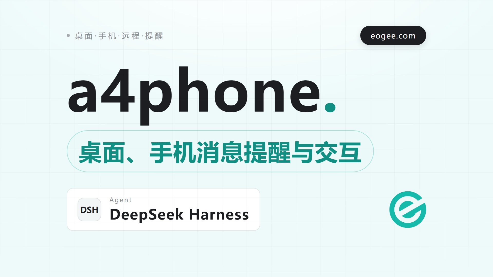

# a4phone

DSH（DeepSeek Harness）/ Claude Code / Codex / ZCode 远程手机交互包。通过 [ntfy.sh](https://ntfy.sh) 在手机上接收任务完成通知（含 AI 最后输出），对 AI 提问与权限请求进行远程点选或文字作答，并可从手机直接继续对话。

## 功能

- **任务完成通知**：`Stop` 事件（DSH 为 `turn/end`）→ 电脑弹窗 + 手机推送，包含 AI 最后输出的一段话
- **AI 提问交互**：`AskUserQuestion`（Codex 为 `request_user_input`，DSH 为 `ask_user_question`）→ 手机显示选项按钮点选，也可直接发送文字自由作答
- **权限请求交互**：`PermissionRequest` → 手机 Approve/Deny/Always Approve
- **DSH 一键挂载**：`a4p setup` 自动把内置 `dsh-hook` 插件挂到 DSH **全部已装 profile**（web / tui / dsh-tui 等），守护进程周期扫描、新装 profile 自动补挂，让 DeepSeek Harness 同样具备手机交互
- **远程续聊**：守护进程监听主话题，手机发文字即可与当前会话交流，形成完整远程对话闭环（DSH / Claude Code / Codex / ZCode / CodeBuddy）
- **DSH 远程续聊**：手机发文字直接注入 DSH 正在运行的会话（`agent.followup`），手机消息与 AI 回复**实时出现在桌面端会话里**，无需另起进程、无会话锁冲突
- **后台守护进程**：`a4p listen` 无窗口后台运行，日志写入文件
- **桌面弹窗守护进程代发**：提问 / 权限请求 / 任务完成的电脑弹窗统一由常驻守护进程弹出（hook 进程——尤其 ZCode——退出时会被执行端口杀掉整棵进程树，hook 内直接弹来不及显示；守护进程在进程树之外，稳定可靠且不增加 hook 延迟）
- **自动更新提醒**：守护进程周期检查 npm 新版本并**推送手机提醒**；其他命令发现新版本时终端提示 + 手机推送（默认开启，可在配置关闭）
- **双模式**：外出模式（手机优先）/ 终端优先模式，一键切换
- **零第三方依赖**：仅依赖 ntfy.sh 免费服务，无 Google 服务依赖

## 安装

```bash
npm install -g a4phone
```

## 使用

```bash
a4p setup        # 安装引导：生成话题、注册 Hook、启动守护进程、注册开机自启、显示二维码
a4p out          # 外出模式（手机优先）
a4p home         # 终端优先模式（默认）
a4p status       # 查看当前模式
a4p listen       # 后台运行续聊守护进程（无窗口）
a4p listen --stop     # 停止守护进程
a4p listen --status   # 查看守护进程状态
a4p autostart    # 查看开机自启状态（--on 开启 / --off 关闭）
a4p resume       # 手动续聊最近会话：a4p resume 要追加的内容
a4p last         # 查看最近会话记录
a4p test         # 发送测试通知
a4p uninstall    # 移除 Hook 和配置
a4p --version    # 查看版本号
a4p help         # 显示帮助
```

### 安装引导

`a4p setup` 自动完成：

1. 生成独一无二的话题名称（如 `a4p-xxxx`），写入 `~/.a4phone/config.json`
2. 在 `~/.claude/settings.json` 注册三个 Hook（Stop / AskUserQuestion / PermissionRequest），同时写入 `~/.codex/config.toml` 的 Codex Hook（见下文 [Codex](#codex) 一节）、`~/.zcode/cli/config.json` 的 ZCode Hook（见下文 [ZCode](#zcode) 一节）与 `~/.codebuddy/settings.json` 的 CodeBuddy Hook（见下文 [CodeBuddy](#codebuddyworkbuddy) 一节）
3. 检测到 DSH 环境时，把内置 `dsh-hook` 插件挂载到 `~/.dsh/profiles/` 下**所有 profile** 的 `cordis.patch.yml`（web / tui / dsh-tui 等；守护进程后续每 10 分钟重扫，新装 profile 自动补挂，见下文 [DSH](#dshdeepseek-harness) 一节）
4. **默认启动续聊守护进程**（`a4p listen` 后台运行）
5. **默认注册开机自启**（Windows 启动文件夹写入隐藏 VBS，登录时自动运行守护进程）
6. 在终端显示二维码

然后用手机 ntfy App 扫描二维码或输入话题名称订阅；DSH 插件热生效无需重启，重启 Claude Code / Codex / ZCode 会话后 Hook 生效。

> 开机自启无需管理员权限（当前用户启动文件夹），可用 `a4p autostart --off` 关闭、`--on` 重新开启；`a4p uninstall` 会一并移除。WSL/Linux 暂不支持自动注册，可手动用 tmux / systemd 常驻。

### 模式切换

```bash
a4p out        # 外出模式：提问/权限请求优先推送手机，超时终端兜底
a4p home       # 终端优先模式（默认）：直接走终端，手机不参与
a4p status     # 查看当前模式
```

> 切换即时生效，无需重启会话。

### 桌面弹窗

AI 提问、权限请求、任务完成时的**电脑弹窗**统一由**常驻续聊守护进程**（`a4p listen`）代发：

1. hook / DSH 插件触发时，把通知请求原子写入 `~/.a4phone/notify-queue/`（而不是 hook 进程里直接弹窗）
2. 守护进程每 2 秒扫描队列，逐条弹出后删除请求文件；守护进程停运期间积压超过 60 秒的请求自动丢弃，避免恢复后批量轰炸
3. 守护进程不在运行时回退为直接弹窗（Claude Code / Codex / DSH 的宿主进程常驻，直接弹可正常显示）

这样做的原因：**ZCode 的执行端口会在 hook 命令退出时杀掉整棵进程树**，hook 内 fire-and-forget 的气泡来不及渲染（已实测：hook 进程存活时气泡可见、一退出即被掐断）；改由 hook 进程树之外的守护进程弹出则稳定可靠，且不增加 hook 延迟（对 Claude Code / Codex 也无副作用）。

### AI 最后输出

`Stop` 事件触发时，a4phone 读取会话记录（transcript），把 AI 最后输出的一段话（截断到 1000 字符）连同目录、会话 ID 一起推送手机，让你离开电脑也能看到任务的实际结果。

### 手机自由文本作答

`AskUserQuestion` 提问推送手机后，除了点选选项按钮，还可以**直接向响应话题 `{topic}-response` 发送文字**作为答案，自由回答不受选项限制。ntfy 单条推送最多 3 个按钮，选项超过 3 个时自动降级为编号列表，回复对应编号即可选中选项。

### 远程续聊

在手机端直接向**主话题 `{topic}`** 发送文字，即可与最近会话（DSH / Claude Code / Codex）继续对话——无需额外的续聊话题，你订阅的通知话题就是对话通道。

1. 启动续聊守护进程（后台无窗口运行）：

   ```bash
   a4p listen            # 后台运行
   a4p listen --status   # 查看状态
   a4p listen --stop     # 停止
   ```

   日志写入 `~/.a4phone/daemon.log`。

2. 手机 ntfy App 已订阅主话题 `{topic}`（`a4p setup` 生成，扫描二维码即可），向该话题发送任意文字即可。

3. 守护进程收到手机消息后，按最近会话的 agent 执行续聊（DSH：经文件队列交给 `dsh web` 进程内的插件直接 `followup` 到当前 live 会话；Claude Code：`claude --resume <会话> --continue -p`；Codex：`codex exec resume <会话> -o <临时文件> -`，`-o` 捕获最后一条回复；ZCode：headless 调 `zcode.cjs --prompt <消息> --resume <会话> --json`，从 JSON 的 `response` 字段取回复；CodeBuddy：headless 调 `codebuddy -p <消息> --resume <会话> --output-format json`，从 JSON 数组的 `result` 字段取回复）。均为 headless，捕获回复后推回手机。Codex 会话若被窗口占用（thread-store conflict），a4phone 会自动把它 fork 成新线程续聊——**不需要关闭原窗口**，原会话原样保留，手机对话在 fork 上继续。

4. 无需守护进程时，也可在电脑上手动续聊：

   ```bash
   a4p resume 帮我总结一下刚才的改动
   ```

5. 查看最近会话记录：

   ```bash
   a4p last
   ```

> 续聊完全 headless 运行（无需窗口标题匹配、前台焦点或剪贴板，也不依赖你当前是否开着终端），支持 DSH、Claude Code、Codex、ZCode 与 CodeBuddy 会话（按最近会话的 agent 自动选择续聊方式）。续聊回合内若再次触发提问/权限请求，仍会推送手机，形成完整的远程对话闭环。
>
> **ZCode 续聊的模型跟随**：ZCode 的模型/provider 由桌面 app 管理（`~/.zcode/v2/config.json`），headless 续聊需要 `~/.zcode/cli/config.json` 里有显式模型配置。a4phone 在每次续聊前从该会话的 rollout 记录读取**会话实际使用的模型**，并自动同步到 `~/.zcode/cli/config.json` —— 你在桌面端切换模型后，续聊自动跟随切换后的模型（`a4p setup` 会先写入一个默认配置）。
>
> **积压合并**：一轮续聊最长可达 `resumeTimeout`（默认 30 分钟），期间手机连续发来的消息会自动**合并为一个批次**一次性续聊（不再逐条排队、每条一个独立轮次），保证手机内容一定能送达 AI；积压批次持久化到 `~/.a4phone/pending-batch.json`，守护进程重启/崩溃后自动恢复，不丢消息。

## Codex

`a4p setup` 会同时自动配置 Claude Code 和 Codex。Codex 配置追加到 `~/.codex/config.toml` 末尾（保留原有设置），结构如下：

```toml
[features]
hooks = true

[[hooks.Stop]]
[[hooks.Stop.hooks]]
type = "command"
command = "a4p hook codex"

[[hooks.PreToolUse]]
matcher = "request_user_input"
[[hooks.PreToolUse.hooks]]
type = "command"
command = "a4p hook codex"

[[hooks.PermissionRequest]]
[[hooks.PermissionRequest.hooks]]
type = "command"
command = "a4p hook codex"
```

> 注意：启用项必须放在 `[features]` 表内（`[features] hooks = true`），不能写成根级别的裸 `hooks = true`，否则与 `[[hooks.*]]` 冲突导致 TOML 解析错误。Codex 会话中需运行 `/hooks` 并手动信任新 Hook。
>
> Codex 的提问工具叫 `request_user_input`（不是 `AskUserQuestion`），PreToolUse 的 matcher 必须匹配该名称 hook 才会触发。Codex 端无法像 Claude Code 那样用 `updatedInput` 注入答案，a4phone 采用"阻断工具调用、把手机答案写进阻断原因"的方式，让模型看到答案后直接采用继续。

## ZCode

`a4p setup` 会同时自动配置 ZCode。Hook 写入 `~/.zcode/cli/config.json`（保留原有 MCP、插件等设置）。与 Claude Code 不同，ZCode 的事件块挂在 `hooks.events` 下，且配置文件 Hook 默认禁用，必须 `hooks.enabled: true` 才会运行（a4phone 写入时自动补上）：

```json
{
  "hooks": {
    "enabled": true,
    "events": {
      "Stop": [ { "matcher": "*", "hooks": [ { "type": "command", "command": "a4p hook zcode" } ] } ],
      "PreToolUse": [ { "matcher": "AskUserQuestion", "hooks": [ { "type": "command", "command": "a4p hook zcode" } ] } ],
      "PermissionRequest": [ { "matcher": "*", "hooks": [ { "type": "command", "command": "a4p hook zcode" } ] } ]
    }
  }
}
```

ZCode 支持的事件与 Claude Code 一致（`Stop` / `PreToolUse` / `PermissionRequest`），提问工具也叫 `AskUserQuestion`。与 Claude Code 有两个关键差异：

- **提问触发两次 hook**：ZCode 对一次 `AskUserQuestion` 会同时触发 `PreToolUse` 和 `PermissionRequest` 两个 hook。a4phone 只在 `PreToolUse` 分支弹「有提问需要处理」提醒（`PermissionRequest` 分支对提问跳过弹窗，避免重复通知和误导性的「有权限请求需要处理」文案）；外出模式下两者配合完成手机作答——提问走 asku 注入答案（`updatedInput.answers`），权限请求自动放行（`decision.behavior: "allow"`），与 ZCode 的 hook 输出 schema 兼容。
- **桌面弹窗需守护进程代发**：ZCode 的执行端口会在 hook 命令退出时杀掉整棵进程树，hook 内直接弹窗来不及渲染。因此桌面弹窗统一由常驻守护进程从 `~/.a4phone/notify-queue/` 队列代发（见 [桌面弹窗](#桌面弹窗)），**ZCode 的桌面提醒依赖守护进程在运行**（`a4p setup` 默认启动并注册开机自启；`a4p listen --status` 可随时查看状态）。

> 重启 ZCode 会话后 Hook 生效。提问与权限请求的桌面弹窗在 home / out 模式下均会触发；手机点选仅外出模式参与。**远程续聊已支持 ZCode 会话**（headless 调 zcode CLI，见 [远程续聊](#远程续聊)）；`a4p uninstall` 会一并移除 ZCode Hook。

## CodeBuddy（WorkBuddy）

`a4p setup` 会同时自动配置 CodeBuddy。CodeBuddy 是腾讯 WorkBuddy 桌面应用内置的 agent CLI（`cli/bin/codebuddy`，产品名 CodeBuddy Code）。Hook 写入 `~/.codebuddy/settings.json`（保留原有插件等设置），结构与 Claude Code 相同，事件与 payload（`hook_event_name` / `tool_name` / `tool_input` / `last_assistant_message`）与 Claude Code 同构，**实测外部写入直接生效**（无需 `/hooks` 面板审核）：

```json
{
  "hooks": {
    "Stop": [ { "matcher": "*", "hooks": [ { "type": "command", "command": "a4p hook codebuddy" } ] } ],
    "PreToolUse": [ { "matcher": "AskUserQuestion", "hooks": [ { "type": "command", "command": "a4p hook codebuddy" } ] } ],
    "PermissionRequest": [ { "matcher": "*", "hooks": [ { "type": "command", "command": "a4p hook codebuddy" } ] } ]
  }
}
```

> CodeBuddy 的提问工具也叫 `AskUserQuestion`。**Windows 上 hook 命令强制用 Git Bash 执行**（不支持 cmd/PowerShell），`a4p` 命令需在 Git Bash 可用（npm 全局安装即满足）。**远程续聊已支持**（headless `codebuddy -p <消息> --resume <会话ID> --output-format json`，会话 ID 为 UUID，见 [远程续聊](#远程续聊)）；`a4p uninstall` 会一并移除 CodeBuddy Hook。
>
> 注意区分：**WorkBuddy** 是桌面应用外壳（有腾讯系插件生态，数据在 `~/.workbuddy`），**CodeBuddy Code** 是它内置的 CLI（hook / headless 续聊能力所在，配置在 `~/.codebuddy`）；另有一个独立的 **CodeBuddy CN**（VSCode 衍生版，`buddycn` 命令）与本适配无关。

## DSH（DeepSeek Harness）

`a4p setup` 检测到 DSH 环境（`~/.dsh/profiles/` 存在）时，会扫描**全部 profile**（web / tui / dsh-tui 及后续新装的变体），把内置的 `dsh-hook` 插件挂载到每个 profile 的 `cordis.patch.yml`，让 DeepSeek Harness 同样具备手机远程交互。插件复用同一 a4phone 话题与模式，手机端无需额外订阅。

| Hook | 触发事件 | 桌面通知 | 手机交互（外出模式） |
|------|---------|---------|---------------------|
| 任务完成 | `turn/end` 且 `reason.kind === 'completed'` | ✔ 电脑弹窗 | 手机推送（含 AI 最后输出） |
| 提问 | `ask_user_question` 工具调用 | ✔ 电脑弹窗「有提问需要处理」 | 手机点选选项 / 文字自由作答 |
| 权限请求 | `approval/request` | ✔ 电脑弹窗「有权限请求需要处理」 | 手机 Approve / Deny |
| 远程续聊 | 文件队列 `~/.a4phone/dsh-jobs/`（a4p 写请求，插件回复） | — | 手机发文字 → `agent.followup` 注入当前会话 → 回复推回手机 |

- 插件位于本包 `dsh/` 目录（Cordis 插件，监听 DSH 的 `session/event`、`tools/execute`、`approval/request` 事件），`a4p setup` 以 insert 形式写入 patch，幂等可重复执行
- 若检测到旧版手动挂载（指向 `C:\ProgramMine\dsh-hook` 的 `id: dsh-hook`），`a4p setup` 会自动替换为本包路径
- `cordis.patch.yml` 被 DSH 热监视（`watchUserPatches`），挂载即时生效；若插件代码有更新，建议重启 `dsh web`（可参考 `restart-dsh-web.ps1` 的思路）
- 模式切换复用同一套：`a4p out`（手机优先）/ `a4p home`（终端优先）；Hook 日志写入 `~/.a4phone/dsh-logs/`
- **多 profile 自动发现**：profile 身份文件为子目录下的 `cordis.yml`；除 `setup` 全量扫描外，续聊守护进程每 10 分钟重扫一次，新装 profile 无需重跑 setup 即可自动补挂
- 提问与权限请求的桌面弹窗在 home/out 模式下均会触发；手机点选仅外出模式参与
- `a4p uninstall` 会同时移除所有 profile 的挂载

### DSH 远程续聊

手机向主话题发文字即可继续 DSH 会话，机制与 Claude Code / Codex 的续聊不同：

1. **记录最近会话**：插件在每次顶层会话 `turn/end`（completed）时写入 `~/.a4phone/last.json`（`agent: "DSH"`），与 Claude Code / Codex 的 Stop Hook 一致
2. **文件队列协议**：`a4p resume` / `a4p listen` 把手机消息原子写入 `~/.a4phone/dsh-jobs/req-<id>.json`；插件每秒扫描，处理后写 `resp-<id>.json`，a4p 轮询取回并推回手机；插件同时刷新 `~/.a4phone/dsh-heartbeat.json` 心跳，a4p 据此快速判断 `dsh web` 是否在运行（未运行会快速失败而非干等超时）
3. **注入到桌面会话**：插件用 `agent.followup()` 把手机文字作为普通 `user/message` 写入**桌面上正在运行的同一个会话**（`ctx.agents` 解析：优先 `last.json` 记录的会话，兜底最近顶层会话），`await agent.whenIdle()` 等待轮次结束，提取最后一条 assistant 文本回推——手机消息与 AI 回复都会**实时出现在桌面端会话里**，桌面与手机看到同一段对话
4. **无会话锁冲突**：不另起进程，所以不存在 Claude Code `--resume` 式的独占锁问题；续聊轮次内若触发提问/审批，仍走手机交互，形成完整闭环
5. 续聊轮次的"任务完成"推送已自动去重（回复由 a4p 推回，插件不再重复通知）

> 前提：`dsh web` 正在运行且已挂载新版 `dsh-hook` 插件（`a4p setup` 自动挂载，插件代码更新后需重启 `dsh web`）。未检测到 `dsh web` 时续聊会快速失败并给出提示。

### ⚠️ 待办：DSH workspace 记账归组缺陷（临时外部方案，关注 DSH 官方修复）

**背景**：DSH 存在一个**已知缺陷**——workspace 注册表的会话记账只在"首次启动"时用 header 归组历史目录，此后产生的会话（旧版 TUI、`dsh headless`、部分启动入口等）只写会话日志、不主动记账，于是永久落在"未分组"。DSH 官方已将其列为**已知待办**（`@deepseek-ai/dsh-workspace` README 的 "Known Limitations and Deferred Work"）。

**a4phone 的临时方案**：在 DSH 插件（`dsh/lib/index.js`）中加入"孤儿会话自愈"，在每次插件启动时把已持久化但未记账的会话按 `header.cwd` 归入对应项目（必要时自动新建 workspace 记录）。该方案：

- **幂等**：只处理未记账的会话，重复运行不重复归组；
- **安全**：失败只记日志，不影响插件启动与其他功能；
- **临时**：仅作为 DSH 官方修复记账 bug 之前的过渡措施。

**迭代检查项（每次功能迭代 / 代码提交前）**：

1. 检查 DSH 官方（`@deepseek-ai/dsh-workspace`）是否已修复 workspace 记账归组；
2. 若已修复，评估并**移除**本插件中的"孤儿会话自愈"模块（`config.healWorkspaces` 开关可先关闭再删代码）——它是与 a4phone 核心功能无关的冗余设计，不应长期保留；
3. 若未修复，保留本方案并在文档更新"已知待办"状态。

**责任划分**：根因是 DSH 核心 workspace 记账缺陷（DSH 官方应修）；dsh-tui / 旧入口只是"不主动记账"的设计使然，非其锅；a4phone 是体验受损方而非制造者。

## 原理

DSH 插件与 Hook（Claude Code / Codex / ZCode）拦截事件后，通过 ntfy.sh 推送带按钮的通知到手机；手机点选或发送文字后，决策经响应话题回传并注入会话。`Stop` 事件同时把 AI 最后输出从会话记录中抽取出来推送手机。电脑弹窗则由常驻守护进程从 `~/.a4phone/notify-queue/` 队列代发（见 [桌面弹窗](#桌面弹窗)）。

```
AI助手触发事件 → a4p hook → ntfy.sh 推送手机 → 手机点选/文字作答 → 决策回传 → 注入会话
```

远程续聊的闭环：

```
手机向 {topic} 发文字 → 守护进程 a4p listen
  → 或 DSH：a4p 写 req 文件 → dsh web 进程内插件 agent.followup 注入会话
           → whenIdle 等待轮次结束 → 提取回复写 resp 文件 → a4p 轮询取回
  → 或 claude --resume <会话> --continue -p（headless，stdin 作为消息）
  → 或 codex exec resume <会话> -o <临时文件> -（Codex，-o 捕获最后一条回复）
  → 或 node zcode.cjs --prompt <消息> --resume <会话> --json（ZCode，续聊前自动同步会话模型）
  → 或 codebuddy -p <消息> --resume <会话> --output-format json（CodeBuddy，JSON result 取回复）
  → AI 回复写入会话并回推手机
  →（DSH 续聊直接发生在桌面正在运行的会话上，手机与桌面看到同一段对话）
  →（Codex 会话被窗口占用时自动 fork 新线程续聊，无需关闭原窗口）
```

### Hook 输出格式

- 提问（PreToolUse）：Claude Code 为 `hookEventName: "PreToolUse"` + `permissionDecision: "allow"` + `updatedInput.answers`（改写工具输入）；Codex 为 `permissionDecision: "deny"` + `permissionDecisionReason` 写入手机答案（阻断 `request_user_input` 调用，让模型直接采用答案继续）
- 权限请求（PermissionRequest）：`hookEventName: "PermissionRequest"` + `decision.behavior`

## 注意事项

- 需 Node.js 18+，手机端安装 ntfy App
- 手机订阅后，请在**订阅设置**中开启"即时交付"，否则消息需手动刷新才能收到
- 续聊支持 DSH、Claude Code、Codex、ZCode 与 CodeBuddy 会话（按最近会话的 agent 自动选择方式）；DSH 续聊需 `dsh web` 正在运行且已挂载新版插件；Codex 续聊通过 `codex exec resume` 执行，需 Codex CLI 已登录、hook 已信任；ZCode 续聊需 ZCode 桌面端已安装（自动探测 `zcode.cjs` 路径），续聊前自动同步会话模型到 `~/.zcode/cli/config.json`；CodeBuddy 续聊需 WorkBuddy 已安装（自动探测内置 `codebuddy` CLI）
- DSH 支持任务完成通知 / 提问作答 / 权限审批 / 远程续聊（经内置 `dsh-hook` 插件）
- 续聊期间守护进程会自动临时切换为外出模式，结束后恢复原模式
- Claude Code 会话同一时间只能被一个进程占用，`--resume` 续聊前请先结束终端里仍在运行的原会话；Codex 会话被占用时 a4phone 会自动 fork 新线程续聊（复制会话为新线程 ID，原窗口不受影响，手机对话在 fork 上继续）
- 续聊守护进程默认随 `a4p setup` 启动并注册**开机自启**（Windows 登录时自动运行）；也可手动 `a4p listen`，WSL/Linux 可用 tmux 或 systemd
- **ntfy.sh 免费托管服务有发布速率/消息保留限制**：短时间高频测试可能触发 `limited` 提示，建议降低推送频率（续聊结果已去重推送，不再重复通知）
- ntfy.sh 公共话题可被知晓话题名的人读写，重要场景建议自建 ntfy 服务或使用访问令牌
- ntfy.sh 为国外服务，国内网络下长连接可能不稳定
- **自动更新提醒**：默认开启（`checkUpdates: true`）。守护进程（`a4p listen`）启动时及每 `updateIntervalHours` 小时（默认 6）检查一次 npm registry（npmmirror 优先、官方兜底），发现新版本**推送手机提醒**；其他命令（`a4p status`/`a4p resume` 等）发现新版本时**终端提示 + 手机推送**（与守护进程共用去重缓存，同一版本只提醒一次）。查询失败静默跳过，不影响正常功能；可在 `~/.a4phone/config.json` 设 `checkUpdates: false` 关闭
- 配置存储于 `~/.a4phone/config.json`，最近会话存储于 `~/.a4phone/last.json`，模式存储于 `~/.a4phone/mode.json`，守护进程信息存储于 `~/.a4phone/daemon.json`，日志写入 `~/.a4phone/daemon.log`；DSH Hook 日志写入 `~/.a4phone/dsh-logs/`，DSH 续聊队列位于 `~/.a4phone/dsh-jobs/`，心跳位于 `~/.a4phone/dsh-heartbeat.json`，桌面通知队列位于 `~/.a4phone/notify-queue/`，更新检查缓存位于 `~/.a4phone/update-cache.json`

## 开发

```bash
npm install              # 安装依赖
node bin/a4p.mjs setup   # 本地调试
```

## 开源协议

[MIT](LICENSE)
